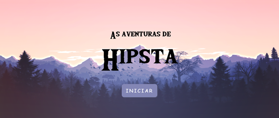

<h4 align="center">
 
 <b>#IMERSAOGAMEDEV</b> ️
</h4>

  
  <a>
    

 

### :rocket: Tecnologias usadas
Este projeto foi desenvolvido com as seguintes tecnologias:
- [Javascript](https://devdocs.io/javascript/)
-  [p5.js](https://p5js.org/)

### :muscle: Projeto

Este jogo foi desenvolvido com o uso da p5.js: uma biblioteca JavaScript específica para animações, muito utilizada por programadores no mundo todo, mas ainda deixa o principal do jogo a ser escrito. 

-  [Link para o jogo](https://editor.p5js.org/luidgisamuel/full/u-1vz4EQc)

### :recycle: Como contribuir

- Fork esse repositório;
- Crie uma branch com a sua feature: `git checkout -b my-feature`
- Commit suas mudanças: `git commit -m 'feat: My new feature'`
- Push a sua branch: `git push origin my-feature`

### :mortar_board: Quem ministrou?

A semana foi ministrada pelos instrutores: [Juliana Negreiros](https://twitter.com/juunegreiros), [Guilherme Lima](https://twitter.com/guilhermebzlima) e [Paulo Silveira](https://twitter.com/paulo_caelum)

### :memo: Licença

Esse projeto está sob a licença MIT. Veja o arquivo [LICENSE](LICENSE.md) para mais detalhes.

